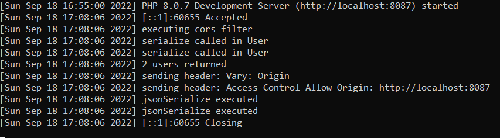
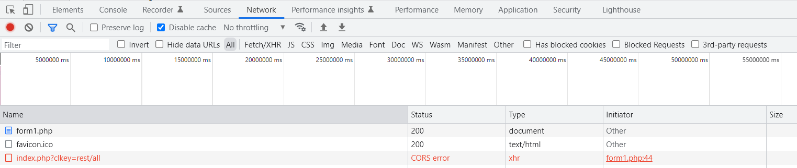
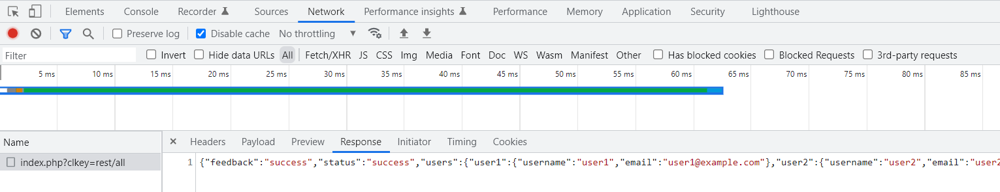

## CodeLib Sample: CORS AND REST

### Description

This sample illustrates how you can easily provide CORS support in CodeLib. It also shows how simple it is in CL to put 
together a REST server.

##### CORS Support

CORS support can be as easy as adding a configuration entry to your server side code, to activate CORS support:

##### $clconfig->addAppConfig(CORS, true)

If nothing else is specified, the CORS check will happen, but it will be very permissive, as the default configuration will be used, which allows 
all origins, all headers and all methods.

In order to restrict the above, let's say to only allow request from a specific Origin, you can specify that Origin in the CORS config setting as below:

##### $clconfig->setCors(['Access-Control-Allow-Origin' => ['http://example.com']])

Take a look at server/index.php in this sample to see this in action.

##### REST Server

In server/index.php you can see this line:

**->addPlugin('rest.*', 'RestPlugin')**

It adds the **RestPlugin** (server/plugin/RestPlugin.php) to the app, to handle any _URI_ or _flow key_ with 'rest' on it, like _rest/users_, _rest/user/1_, etc. This Plugin, 
which you can find in the plugin folder of the App, is a regular CL Plugin, with some minor additions:

- It extends **\cl\plugin\CLBasePlugin**, instead of directly implementing the **CLPlugin** interface.
- It then takes advantage of additional functionality provided by the CLBasePlugin, including mapping of http methods to 
Plugin functions. Notice that to achieve that, all that is required is to **override** the _protected function **mapHttpMethod()** : array_, 
  and return an associative array, with the http method as key and the Plugin function as value. That's it!

### Running this Sample

First, install the dependencies (framework) by going to the console, at the root of 
this sample's _server folder_, and running **composer install**.

For the purpose of demonstrating this concept, this sample has been divided into a REST client and server.
- Start the server by changing to the server/ folder and running the provided startserver script (startserver.sh for Unix-like OS or startserver.bat for Windows)
- Run the client, from within the client folder/ using the provided startclient script (startclient.sh for Unix-like OS or startclient.bat for Windows). 
- Notice (by looking at those scripts) that the client will start on port 8000, and the server will start on port 8087. 
   
- So, in your web browser, go to http://localhost:8000/form1.php. 
In this way, you would be running a client file, form1.php, which submits AJAX requests to the server when you choose any of the 3 provided options (get, post and put). 
So, if you have restricted the server to accept requests only from its own location (localhost:8087), it should reject requests from the client.
The CORS preflight mechanism will fail due to the request coming from a different origin.
- To view the server response, if you are using Google Chrome or related browser, in the context menu, go to More Tools -> Developer Tools -> Network tab.
  Then reload the page, so that the Network section is properly updated. 
  If you are using Mozilla Firefox, go to More Tools -> Web Developer Tools -> Network tab, and reload. 
   
You can easily make it succeed by simply changing the port in server/index.php: 

In the line that reads: _**->setCors(['Access-Control-Allow-Origin' => ['http://localhost:8087']])**_

change the port from **8087** to **8000**. 
Alternatively, change the entry to allow all origins:
**->setCors(['Access-Control-Allow-Origin' => ['*']])**

Then run the client request again.
 
Once it gets past the CORS check, you should see the result of your request, as JSON, under the Network Tab as explained above.

